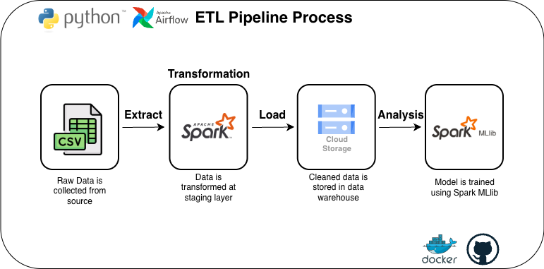

# Housing ETL ML Pipeline 
My goal of this project is to practice building an end-to-end ETL and machine learning pipeline for a regression problem using Apache Spark. The pipeline downloads raw data from Kaggle in CSV format, perform large-scale data cleaning and feature engineering, and transforms the data into batch-partitioned Parquet files stored in cloud storage. The processed data is then used to train and evaluate a regression model, which is saved for future production use. This project demonstrates skills in data engineering fundamentals, distributed data processing, and production-style ML workflows.

## Table of Contents
- [Technologies & Tools](#technologies--tools)
- [About Data](#about-data)
- [Pipeline Diagram](#pipeline-diagram)
- [Project Reproduction](#project-reproduction-try-it-yourself)
- [Project Structure](#project-structure)
- [Sample Model Metrics](#sample-model-metrics)
- [Future Improvements](#future-improvements)

## Technologies & Tools
#### Google Cloud Platform
- **Google Cloud Platform** (GCP)
- **Google Cloud Storage** (GCS) - Staging data lake, batch-partitioned cleaned datasets and trained ML models
#### Orchestration & Transformation
- **Apache Airflow** - Pipeline orchestration
- **Apache Spark (PySpark)** - For data transformation and feature engineering
#### Machine Leaning
- **Spark MLlib** - For Linear Regression model training and evaluation
#### Enviroment & Language
- **Docker & Docker Compose** - For local development and environments management
- **Python** - Programming Language for data extraction, transformation, and loading

## About Data
The dataset used in this project is downloaded from Kaggle: [California housing price](https://www.kaggle.com/datasets/marcogtt/california-housing). It is derived from the 1990 U.S. Census and contains one row per census block group. The dataset includes 9 features and 1 target variable (median_house_value):

**Features**:
- **longitude** - Geographic coordinate representing the east–west position of the block
- **latitude** - Geographic coordinate representing the north–south position of the block
- **housing_median_age** - Median age of houses in the block
- **total_rooms** - Total number of rooms within the block
- **total_bedrooms** - Total number of bedrooms within the block
- **population** - Total number of people residing within the block
- **households** - Total number of households within the block
- **median_income** - Median household income in the block (measured in tens of thousands of U.S. dollars)
- **ocean_proximity** - Categorical feature indicating proximity to the ocean

**Target Variable**:
- **median_house_value** - Median house value for households in the block (measured in U.S. dollars)

## Pipeline Diagram
<p align="center">
    
</p>

## Project Reproduction (Try it Yourself)
1. Clone the repository:
    ```bash
    git clone https://github.com/yueyue426/housing-spark-ml-pipeline.git
    cd housing-spark-ml-pipeline
    ```
2. Set Up GCP:
    - Create a GCP account (if you don't have one).
    - Create a GCP Project.
    - In **IAM & Admin**, create a Service Account.
    - Generate a JSON key for the service account and place it in the secrets folder.
    - Create a Cloud Storage (GCS Bucket).
    - Inside the bucket, create folders such as: `features`, `models`, `processed`, `raw`, `staging`
3. Set Up Docker:
    - Download & Install Docker Desktop:
        - [Install Docker Desktop on Windows](https://docs.docker.com/desktop/setup/install/windows-install/)
        - [Install Docker Desktop on Mac](https://docs.docker.com/desktop/setup/install/mac-install/)
4. Set Up Airflow:
    - In the project directory, create folders for Airflow so it can share files and logs between the host machine and the Docker containers:
        ```bash
        mkdir -p ./dags ./logs ./plugins
        ```
    - Create a .env to store enviroment variables:
        ```python
        GCP_PROJECT_ID=[YOUR_GCP_PROJECT_ID]
        GCS_BUCKET=[YOUR_GCS_BUCKET]
        GCP_SERVICE_ACCOUNT_KEY=/opt/airflow/secrets/[YOUR_KEY_FILE].json

        AIRFLOW_UID=[YOUR_UID]
        AIRFLOW_GID=[YOUR_GID]
        AIRFLOW__CORE__LOAD_EXAMPLES=False
        ```
        You can check your UID and GID with:
        ```bash
        id -u # UID
        id -g # GID
        ```
    - Update constant variables in `housing_etl_pipeline.py` and `ml_model.py` if needed:
        ```bash
        GCS_BUCKET = os.environ.get("GCS_BUCKET", "[YOUR_GCS_BUCKET]")
        ```
5. Initialize Airflow. Open Docker Desktop, then run:
    ```bash
    docker compose up airflow-init
    ```
6. Start all Airflow services:
    ```bash
    docker compose up -d
    ```
7. Access Airflow UI at: http://localhost:8080
    - Create the `google_cloud_default` Connection:
        - In the Airflow UI, go to **Admin** -> **Connections**.
        - Click the blue **`+`** button to create a new connection.
        - Enter the Configuration:
            - **Conn Id**: `google_cloud_default`
            - **Conn Type**: `Google Cloud`
            - **Keyfile Path**: `/opt/airflow/secrets/[YOUR_KEY_FILE].json`
            - **Project Id**: Your GCP project ID
        - Click **Save**.
8. Run the Aiflow DAG
    - In the Airflow UI, find the DAG (e.g. `housing_etl_pipeline`)
    - Toggle it On if needed.
    - Click the **Trigger** DAG button to run the pipeline.
        

## Project Structure
```
.
├── dags/                              # Airflow DAG definitions
│   └── housing_etl_pipeline.py
├── data/raw/                          # Raw dataset downloaded from Kaggle
│   └── housing.csv
├── spark_jobs/                        # PySpark scripts for ETL and ML pipeline
│   ├── staging_to_raw_batches.py
│   ├── data_clean.py
│   ├── add_features.py
│   └── ml_model.py
├── logs/                              # Airflow logs
├── plugins/                           # Custom Airflow plugins (optional)
├── secrets/                           # Service account keys (not committed to Git)
├── jars/                              # Additional Spark JAR dependencies
├── .env                               # Environment variables for Airflow
├── docker-compose.yaml                # Airflow + Spark environment services
├── Dockerfile                         # Custom Docker image
├── requirements.txt                   # Project dependencies
└── README.md                          # Project documentation
```
## Sample Model Metrics
- **MAE**: Shows how many dollars, on average, the predictions are off from the actual values.
- **RMSE**: Similar to MAE but gives bigger penalties to large mistakes, so it highlights big errors more.
- **$R^2$**: Tells how well the model fits the data — higher means the model explains more of the variation in house prices.

## Future Improvements
- Add automated tests
    - Unit tests for Spark transformation functions (e.g., data_clean.py, add_features.py) to check schema, null handling, and feature values on small sample data.
    - Integration tests that run the full staging_to_raw_batches.py job on a mini dataset and verify row counts, partitions, and output files in GCS.
    - Airflow DAG tests to ensure the DAG loads correctly, task dependencies are valid, and retry logic behaves as expected.
- Add data quality checks
    - Validate schema, allowed value ranges, and missing values before training the model.
    - Fail the pipeline or alert if data quality drops below a threshold.
- Add basic logging and alerts for DAG failures or long runtimes.

